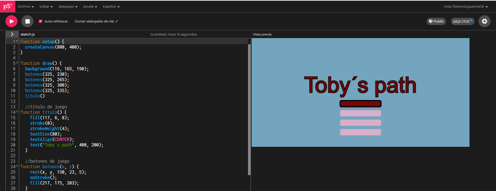

# ENCARGO-SOLEMNE-II-Pensamiento-Computacional
# Toby's Path

## Autor
**Florencia Guzmán**

---

## Descripción del proyecto

Este proyecto consiste en un sistema visual dinámico e interactivo desarrollado en p5.js, que simula el menú principal de un videojuego.

En la pantalla principal se observa un título y una serie de botones, donde el botón principal (Play) reacciona al pasar el cursor por encima (hover), cambiando su color y al hacer click, se activa una animación donde un círculo crece hasta cubrir la pantalla, generando la transición hacia una nueva escena.

En la pantalla final se muestra un **sistema generativo simple** compuesto por múltiples círculos que cambian constantemente y de manera random en posición y tamaño.

---

## Descripción conceptual

El proyecto busca relacionarse con el diseño de interfaces y el diseño generativo. No copia una estética específica, sino muestra la lógica de interacción de un menú de videojuego y un sistema computacional dinámico.

Se trabajan principios como:
- Interactividad
- Repetición
- Variación
- Sistema de estados

---

## Sistema de estados

El sistema funciona mediante tres estados principales:

- **menu:** se muestran el título y los botones interactivos  
- **animacion:** se genera una transición visual mediante un círculo que crece  
- **juego:** se despliega un sistema visual generativo dinámico  

---

## Sistema (Input / Proceso / Output)


### Input
- Movimiento del mouse  
- Click del mouse  

### Proceso
- Detección de hover mediante condicionales  
- Cambio de estado según interacción del usuario  
- Uso de loop (for) para generar múltiples elementos  
- Uso de random() para variar posiciones  
- Uso de map() para modificar el tamaño según la posición del mouse  

### Output
- Botones interactivos que reaccionan al cursor  
- Animación de transición  
- Sistema generativo de partículas que cambia constantemente  

---

## Interactividad

El usuario puede interactuar de las siguientes formas:

- Al pasar el cursor sobre el botón Play, este cambia de color  
- Al hacer click en el botón Play, se activa una animación de transición  
- Al mantener presionado el mouse, cambian los colores de las partículas  
- Al presionar la tecla espacio, se vuelve al menú principal  

---

## Problemas durante el proceso y soluciones

Durante el desarrollo del proyecto tuve varios errores que tuve que ir resolviendo:

### 1. Funciones mal ubicadas
Al principio definí funciones como `titulo()` dentro de `draw()`, lo que provocaba errores y comportamientos inesperados.

**Solución:**  
Saqué todas las funciones fuera de `draw()` para que funcionaran correctamente.

---

### 2. Error en el click del botón Play
El botón no reaccionaba al hacer click porque olvidé asignar el cambio de estado correctamente.

**Problema:**
```javascript
estado
---


## Link al sketch en p5.js

(https://editor.p5js.org/florencia.guzman2/sketches/i05NTYkMi)

---

## Reflexión

El proyecto propone entender el diseño como un sistema dinámico en lugar de una imagen estática. A través de reglas simples y la interacción del usuario, se generan cambios visuales constantes que construyen una experiencia interactiva.
